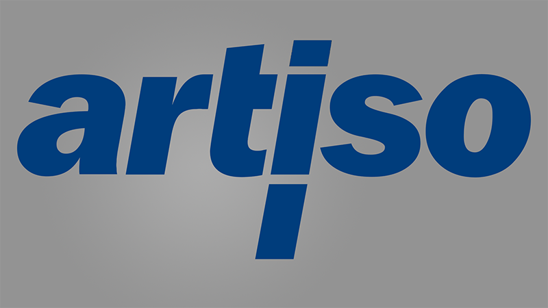
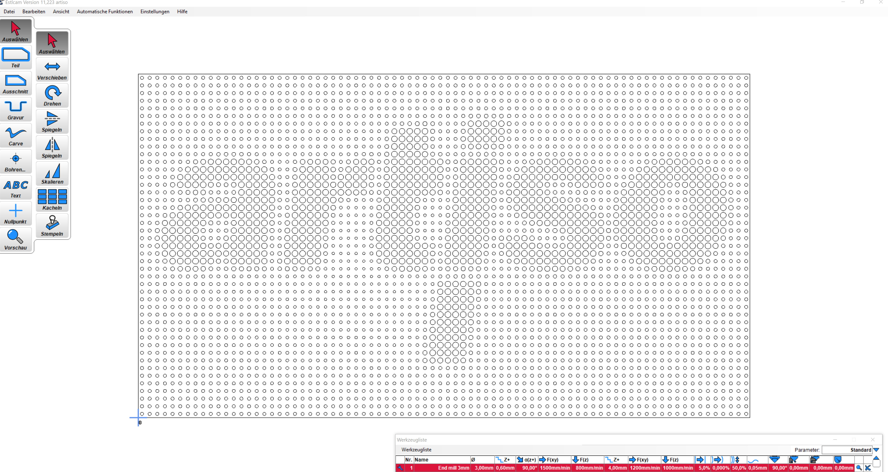
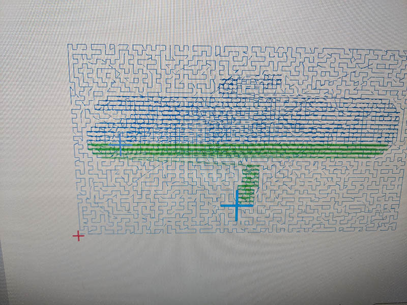
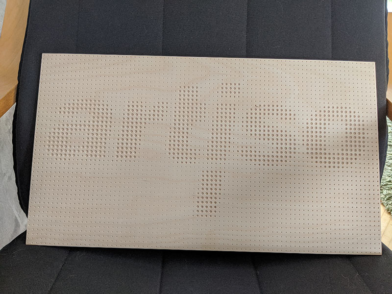
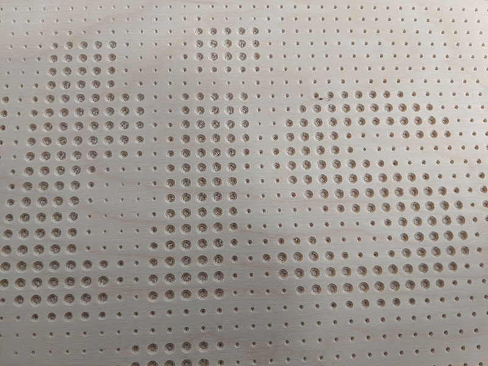

# carved-pixel-image
Python helper to generate a pixelated image from a source image and then generates a dxf file with one circle per pixel for carving on a CNC Router. The idea is to have one circle representing the pixel value via with the diameter of the circle. This way one can use the dxf to create a toolpath for carving on a CNC Router in any material.

# Source Image
A good source image has not too much of details, as it is important to downsample the image. Also the contrast has to be pretty high for good results. One example of an image might be a logo or a portrait. For testing we used our artiso logo changed in the colors and added a simple gradient background:

All image handling is done via [scikit-image](https://scikit-image.org/).

## Resolution
To pixelate the image the resolution of the image should be something common and also the aspect ratio shold be reasonable. For testing we resiyed the image to an aspect ration of 16:9 and also decided how our target resolution should be. We used a target resolution of 80 pixel width and 45 pixel width. Therefore we have chosen a multitude of this resolution for the source image.

## Contrast and colors
The image will be converted to grayscale. In the current version there is no adaption of the contrast or pixel values in the code. That is why one has to play with the source image to optimize the result.

To test the source image one can define the commanline option `--imgsave` to save the grayscale and pixelated image to disk in the same directory as the source image. This can help to optimize the source image in multiple iterations. The pixelated image of the artiso logo looks like this:

# DXF Generation
In order to carve the pixel art with a CNC router we need some way to generate the gcode. As an intermediate step we choose to generate a dxf file with the outline of the image and the pixles as circles with appropriate radius. For the dxf generation we are importing [ezdxf](https://pypi.org/project/ezdxf/). 

Showing this dxf in a CAM program helps deciding if the source image is well prepared for carving in wood.

# Producing Art
The generated dxf can be used to create the toolpaths in any CAM program. For the MPCNC we use [Estlcam](https://www.estlcam.de/). It is very easy to import the dxf and let Estlcam autogenerate the carvings. For the artiso logo we chose to use a 90° engraving bit. The processing of the image can take some minutes depending on the number of circles. After generating the carvings for closed paths one can tweek the parameters of the carvings. We decided to limit the depth to 1.5 mm which looks pretty good. Feel free to play around with the parameters to create a good result for your case.

During processing of the gcode it looks very interesting, as the router takes several passes in almost random order. That might be some way for improvement to generate gcoe based on some templates by ourselves and optimiye the processing order.

The result of the artiso logo carved in plywood on our MPCNC after cutting down the plywood (we engraved the bounding box as guide for cutting) looks very pleasent for us. We are happy with the result.

# Future Optimization
There are some simple improvements waiting for implementation:
 - [ ] Packaging of library for reuse
 - [ ] Narrow down pixel values for more control over pixel radius
 - [ ] Define image size via commandline
 - [ ] Add more variations like one stick per pixel with different length based on pixel value